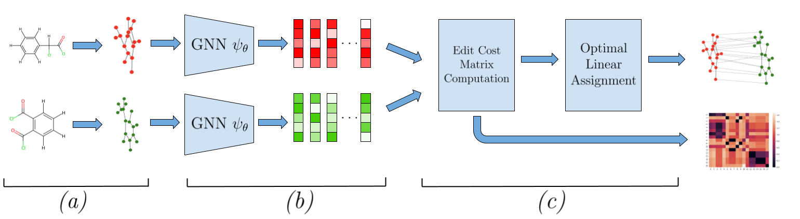

# GraphMatchingSubstitutionMatrices

Code and data repository for the GMSM (Graph Matching Substitution Matrices) model from the RECOMB 2024 paper "Structure- and Function-Aware Substitution Matrices via Learnable Graph Matching". The model learns substitution matrices for biochemical structures over structural alphabets based on class labels (functional information).

|  |
|:--| 
| *Architecture of GMSM. (a) Biochemical structures are transformed into graphs. (b) For each graph, its nodes are represented as a structure-aware embeddings using the same GNN. (c) The model computes the substitution matrix from node embeddings and obtains the graph alignment with respect to the learned substitution matrix.*|

### Citing our work
> Paolo Pellizzoni, C. Oliver and K. Borgwardt. “Structure- and function-aware substitution matrices via learnable graph matching”, in RECOMB, 2024. [[PDF]]()
